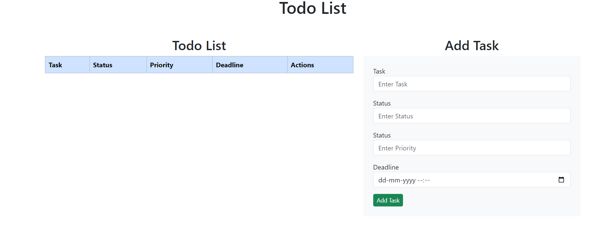
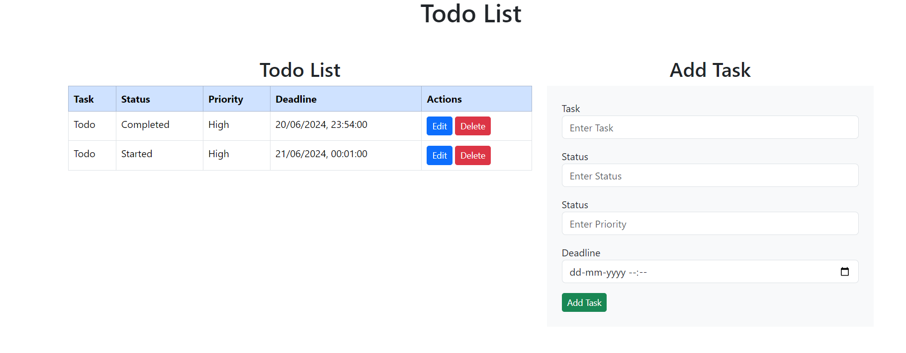
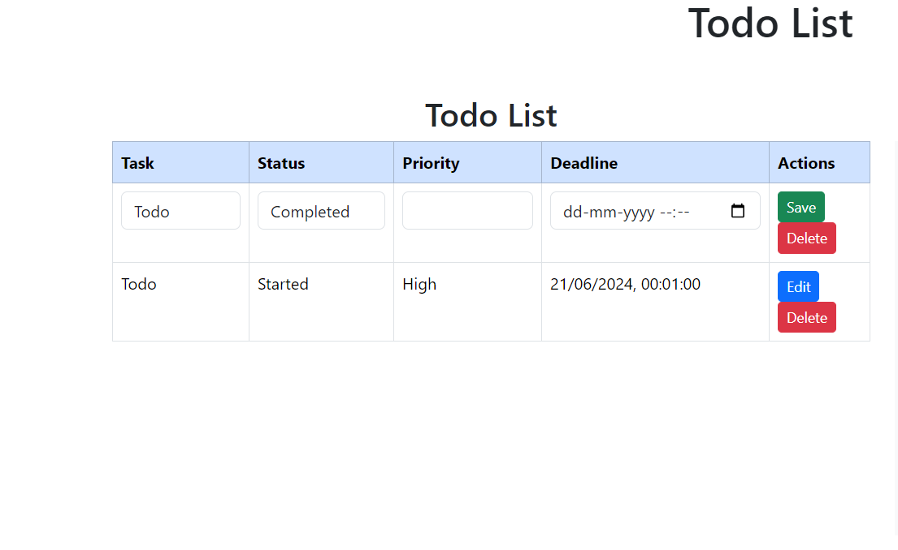

Here's a comprehensive README file for a To-Do List App using the MERN stack. This README includes project details, setup instructions, usage, and screenshots as requested.

---

# To-Do List App



A simple and efficient To-Do List application built using the MERN stack (MongoDB, Express.js, React, Node.js). Manage your tasks effectively by adding, editing, deleting, and marking them as complete.

## Table of Contents

- [Features](#features)
- [Installation](#installation)
- [Usage](#usage)
- [Technologies](#technologies)
- [Project Structure](#project-structure)
- [Screenshots](#screenshots)
- [Contributing](#contributing)

## Features

- **Add Tasks:** Easily add new tasks to your list.
- **Edit Tasks:** Update existing tasks with new details.
- **Delete Tasks:** Remove tasks that are no longer needed.
- 
## Installation

To run this project locally, follow these steps:

1. **Clone the repository:**
   ```bash
   git clone https://github.com/yourusername/todo-list-app.git
   ```

2. **Navigate to the project directory:**
   ```bash
   cd todo-list-app
   ```

3. **Install dependencies:**

   For the backend:
   ```bash
   cd backend
   npm install
   ```

   For the frontend:
   ```bash
   cd ../frontend
   npm install
   ```

4. **Start the development server:**

   For the backend:
   ```bash
   cd backend
   npm start
   ```

   For the frontend:
   ```bash
   cd to-do-list
   npm start
   ```

5. **Access the app:** Open your browser and navigate to `http://localhost:3000`.

## Usage

### Adding a Task

1. Enter the task description in the input field.
2. Click on the "Add Task" button.

### Editing a Task

1. Click the "Edit" button next to the task you want to update.
2. Modify the task details in the input field.
3. Click on the "Update Task" button to save changes.

### Deleting a Task

1. Click the "Delete" button next to the task you want to remove.


## Technologies

- **Frontend:**
  - React
  - Axios (for API requests)
  - Bootstrap (for styling)

- **Backend:**
  - Node.js
  - Express.js
  - MongoDB (Mongoose for data modeling)

## Project Structure

```
todo-list-app/
│
├── backend/            # Backend code
│   ├── model.js        # Mongoose models        # Database configuration
│   └── app.js          # Main app setup
│
├── frontend/           # Frontend code
│   ├── src/            # React components and assets
│   │   / # React components
│   │   ├── Todo.js     # Images and styles
│   │   ├── App.js      # Main app component
│   │   ├── index.js    # Entry point
│   └── public/         # Static files
│
└── README.md           # Project documentation
```

## Screenshots

### Task List View


### Add Task



### Edit Task



## Contributing

Contributions are welcome! Please fork the repository and create a pull request with your changes. Make sure to update tests as appropriate.

1. Fork the Project
2. Create your Feature Branch (`git checkout -b feature/AmazingFeature`)
3. Commit your Changes (`git commit -m 'Add some AmazingFeature'`)
4. Push to the Branch (`git push origin feature/AmazingFeature`)
5. Open a Pull Request


 
