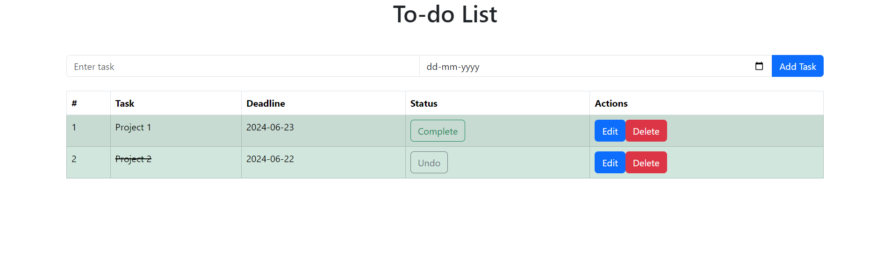

# To-Do List App

This is a simple To-Do List application built using React and React-Bootstrap. 

**No MongoDB**

## Features

- Add tasks with a deadline
- Edit tasks
- Delete tasks
- Mark tasks as complete
- Display tasks in a table format

## Screenshots



## Installation

1. Clone the repository:
   ```bash
   git clone https://github.com/YOUR_USERNAME/todo-list-app.git
